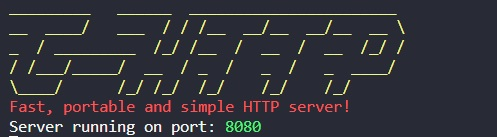

# C-HTTP

***This project is for practicing C, and how to make an HTTP Server from scratch***

# Installation and Dependecies

- Clone the repo

### Installing on Linux (Ubuntu)
- Make sure you have CMake installed, on Ubuntu run the following:
    ```bash
    sudo apt install cmake
    ```
### Installing on MacOS
- Make sure you have CMake installed, on Mac run the following:
    ```bash
    brew install cmake
    ```

***This project uses gcc, it hasn't tested on any other compiler***

## Running

Run on your terminal the following:
```bash
chmod +x build.sh
```
and finally to build and run the server

```bash
./build.sh -r
```
if you only want to build without running;
```bash
./build.sh
```
You'll be received with the following:




## TODO
- Add dynamic memory allocation on request body buffer.

- Add json parser.


## Expected features

- Mounts a server onto a selected port via sockets.
- Can return all HTTP status codes and definitions defined on HTTP 1.1.
- Responds with buffer.

- Dynamic routing
- Matches the requested path with a defined path.
- Allows for query and url parameters.
- Easy route definition with function handlers and HTTP methods.
